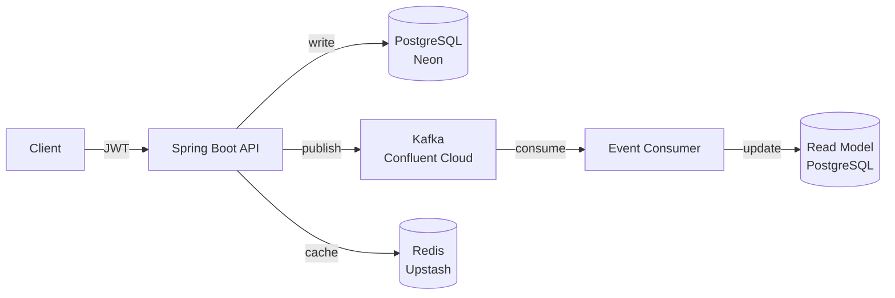

# Order Management API

[](https://github.com/FranceSpa99/order-management-spring/actions/workflows/ci.yml)


A production-ready REST API for order management, built with **CQRS**, **event-driven architecture**, and **JWT-based security**.

**Live:** https://order-management-spring-production.up.railway.app/swagger-ui.html

---

## Architecture



**Request flow:**
1. Client authenticates via Keycloak and sends a JWT
2. API validates the token and writes to PostgreSQL (write model)
3. Domain events (`OrderCreated`, `OrderStatusChanged`) are published to Kafka
4. The event consumer updates a denormalized read model in PostgreSQL
5. Read queries (`/summaries`) hit the read model; hot data is cached in Redis

---

## Tech Stack

| Layer | Technology |
|---|---|
| Runtime | Java 21, Spring Boot 3.5.16 |
| Persistence | PostgreSQL, Spring Data JPA, Flyway |
| Messaging | Apache Kafka, Spring Kafka |
| Caching | Redis, Spring Cache |
| Security | OAuth2 Resource Server, Keycloak (JWT) |
| Observability | Spring Actuator, Micrometer, Prometheus |
| Testing | JUnit 5, Mockito, Testcontainers |
| Infrastructure | Docker, GitHub Actions, Railway |

---

## Getting Started

### Prerequisites

- Docker & Docker Compose
- Java 21

### Run locally

```bash
git clone https://github.com/FranceSpa99/order-management-spring.git
cd order-management-spring
docker compose up -d
./mvnw spring-boot:run
```

The API starts on `http://localhost:8081`. Swagger UI at `http://localhost:8081/swagger-ui.html`.

Docker Compose starts PostgreSQL, Kafka (KRaft), Redis, and Keycloak locally.

---

## API Documentation

Interactive docs at `/swagger-ui.html`. Use the **Authorize** button to paste a Bearer JWT.

### Endpoints

| Method | Path | Auth | Description |
|---|---|---|---|
| `POST` | `/api/v1/products` | Required | Create product |
| `GET` | `/api/v1/products` | Public | List products |
| `GET` | `/api/v1/products/{id}` | Public | Get product |
| `PUT` | `/api/v1/products/{id}` | Required | Update product |
| `DELETE` | `/api/v1/products/{id}` | Required | Delete product |
| `POST` | `/api/v1/orders` | Required | Create order |
| `GET` | `/api/v1/orders` | Required | List orders |
| `GET` | `/api/v1/orders/{id}` | Required | Get order |
| `PATCH` | `/api/v1/orders/{id}/status` | Required | Update status |
| `DELETE` | `/api/v1/orders/{id}` | Required | Cancel order |
| `GET` | `/api/v1/orders/summaries` | Required | Read model query |

---

## Testing

```bash
# All tests (unit + integration)
./mvnw verify

# Single test class
./mvnw test -Dtest=OrderServiceTest

# Integration tests only
./mvnw test -Dtest=OrderServiceIntegrationTest,OrderEventConsumerIntegrationTest
```

Integration tests use **Testcontainers** — real PostgreSQL, Kafka, and Redis containers spin up automatically. No mocks for infrastructure.

Test pyramid:
- **Unit tests** — service logic with mocked dependencies
- **Integration tests** — full Spring context with real containers (`AbstractIntegrationTest` base class)
- **Smoke test** — context loads check

---

## Deployment

The app is deployed on **Railway** with:
- **Neon** — serverless PostgreSQL
- **Upstash** — Redis
- **Confluent Cloud** — managed Kafka (SASL_SSL + PLAIN)

Required environment variables:

```
DB_URL=jdbc:postgresql://<host>/<db>?sslmode=require
DB_USERNAME=...
DB_PASSWORD=...
REDIS_HOST=...
REDIS_PORT=...
REDIS_PASSWORD=...
KAFKA_BOOTSTRAP_SERVERS=...
KAFKA_SASL_JAAS_CONFIG=org.apache.kafka.common.security.plain.PlainLoginModule required username="<key>" password="<secret>";
KEYCLOAK_JWK_SET_URI=https://<keycloak-host>/realms/<realm>/protocol/openid-connect/certs
```

The Docker image sets `SPRING_PROFILES_ACTIVE=prod` by default. Flyway runs migrations on startup.

---

## Design Decisions

### Why CQRS?

Writes and reads have fundamentally different requirements. The write model enforces invariants (stock checks with pessimistic locks, status machine transitions). The read model is denormalized for fast queries — no joins, filterable by customer or status. Separating them lets each evolve independently.

Trade-off: **eventual consistency**. The read model lags behind the write model by the Kafka propagation delay (typically milliseconds). This is acceptable for summaries but not for the order detail view, which still hits the write model directly.

### Why Kafka instead of synchronous updates?

Publishing a domain event decouples the write path from the read model update. If the consumer is down, the event is retained in Kafka and processed when it recovers. A direct DB write in the same transaction would couple the two models and make the write path fail if the read model update fails.

The consumer is **idempotent**: a `processed_events` table records every handled event ID. Duplicate deliveries (Kafka at-least-once guarantee) are silently skipped.

### Why UUID primary keys?

UUIDs are generated by the application, not the database. This means IDs are known before the insert, which simplifies event publishing — the `OrderCreated` event carries the ID without needing a database round-trip. It also avoids leaking sequential IDs to clients (no enumeration attacks).

Trade-off: UUIDs are larger than integers and reduce B-tree efficiency at scale. For this use case the trade-off is acceptable.

### Why Keycloak?

Delegating authentication to an external IdP means the API never handles credentials. Keycloak issues JWTs the API validates locally (no remote call per request). The same IdP can serve multiple services. Roles live in the JWT (`realm_access.roles`) and are extracted by a custom `JwtAuthenticationConverter`.

### What would change in production at scale?

- **Transactional Outbox** instead of direct Kafka publish — eliminates the dual-write problem between the DB commit and the Kafka send
- **Avro + Schema Registry** instead of JSON — schema enforcement and backward compatibility
- **Distributed tracing** with OpenTelemetry + Jaeger
- **Kubernetes** with horizontal pod autoscaling for the consumer
